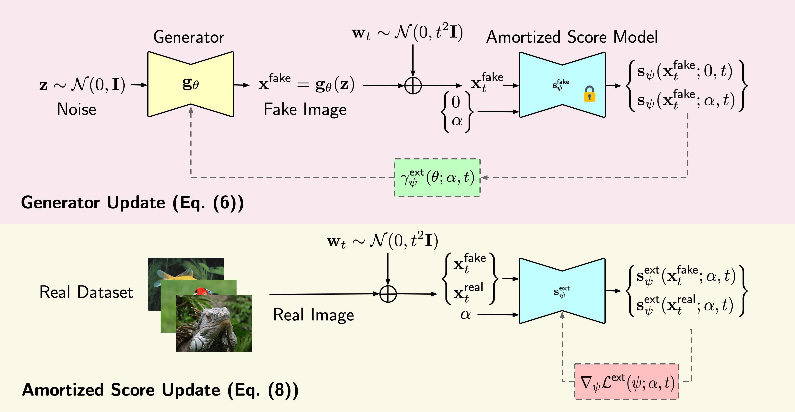

# **Score-of-Mixture Training**  
### Training One-Step Generative Models Made Simple via Score Estimation of Mixture Distributions

---

This is the official code accompanying the Spotlight paper at ICML 2025:

[](https://icml.cc/virtual/2025/events/2025SpotlightPosters)
[](https://arxiv.org/abs/2502.09609)
[](https://openreview.net/forum?id=zk5k2NQcEA)

**Score-of-Mixture Training: Training One-Step Generative Models Made Simple via Score Estimation of Mixture Distributions** 

*Tejas Jayashankar, Jongha (Jon) Ryu and Gregory Wornell*




**Note: This code is being actively developed.  Please check back for updates.**

## Installation

The code is built on the open sourced code of [DMD2](https://github.com/tianweiy/DMD2).  Please refer to the [README](https://github.com/tianweiy/DMD2/blob/main/README.md) for 
the installation and environment setup instructions. 

To make things easier, we have provided an environment file `environment.yml` that you 
can use to create a conda environment.

````bash
conda env create -f environment.yml
conda activate dmd2
````

## Dataset Preparation

We use the CIFAR-10 and ImageNet-64x64 datasets in our experiments. The dataset preparation for the latter
is similar to that of DMD2.

````bash
mkdir -p datasets/imagenet && \
cd datasets/imagenet && \
wget -O imagenet-64x64_lmdb.zip "https://huggingface.co/tianweiy/DMD2/resolve/main/data/imagenet/imagenet-64x64_lmdb.zip?download=true" && \
unzip imagenet-64x64_lmdb.zip
````

## FID Testing Preparation

Download the Inception model weights and place them in the `pretrained_models` directory.

````bash
mkdir -p pretrained_models && \
cd pretrained_models && \
wget https://api.ngc.nvidia.com/v2/models/nvidia/research/stylegan3/versions/1/files/metrics/inception-2015-12-05.pkl
````

Then download the FID reference images for CIFAR-10 and ImageNet-64x64 datasets in the `fid-refs` directory.

````bash
mkdir -p fid-refs && \
cd fid-refs && \
wget https://nvlabs-fi-cdn.nvidia.com/edm/fid-refs/imagenet-64x64.npz && \
wget https://nvlabs-fi-cdn.nvidia.com/edm/fid-refs/cifar10-32x32.npz
````

## Training

To train a model using SMT from scratch, follow the scripts in the `scripts/sjsd` directory. For example, to train a model on ImageNet-64x64, run:

````bash
bash experiments/imagenet/imagenet_sjsd.sh runs/imagenet_sjsd 5
````

We use wandb to log the training progress.  Don't forget to set your wandb API key before running the training script.  You can specify this in `experiments/imagenet/imagenet_sjsd.sh` by setting the `WANDB_API_KEY` environment variable.

To train a model using SMD with a pre-trained model, follow the scripts in the `scripts/sjsd_dist` directory. Before running the training command you will need to download the pre-trained diffusion model.

````bash
cd pretrained_models && \
wget https://nvlabs-fi-cdn.nvidia.com/edm/pretrained/edm-imagenet-64x64-cond-adm.pkl && \ 
wget https://nvlabs-fi-cdn.nvidia.com/edm/pretrained/edm-cifar10-32x32-uncond-vp.pkl
````

Then, you can run the training script for CIFAR-10 or ImageNet-64x64 using the pre-trained model.

````bash
bash experiments/imagenet/imagenet_sjsd_dist.sh runs/imagenet_sjsd_dist 5
````

Note that the shell script will automatically kick off a training run on 7 GPUs and an
evaluation job on 1 GPU. For more details on the evaluation and the standalone generation
script refer to the [DMD2 README](https://github.com/tianweiy/DMD2/blob/main/experiments/imagenet/README.md).

## Citation

If you find this code useful, please consider citing our paper:

```bibtex
@inproceedings{jayashankar2025score,
  title={Score-of-Mixture Training: Training One-Step Generative Models Made Simple via Score Estimation of Mixture Distributions},
  author={Jayashankar, Tejas and Ryu, J Jon and Wornell, Gregory},
  journal={International Conference on Machine Learning (ICML)},
  year={2025}
}
```

## Acknowledgements

This work was supported in part by the MIT-IBM Watson AI
Lab under Agreement No. W1771646, by MIT Lincoln Laboratory, by ONR under Grant No. N000014-23-1-2803, and
by the Department of the Air Force Artificial Intelligence
Accelerator under Cooperative Agreement No. FA875019-2-1000. The views and conclusions contained in this
document are those of the authors and should not be interpreted as representing the official policies, either expressed
or implied, of the Department of the Air Force or the U.S.
Government. The U.S. Government is authorized to reproduce and distribute reprints for Government purposes
notwithstanding any copyright notation herein.
